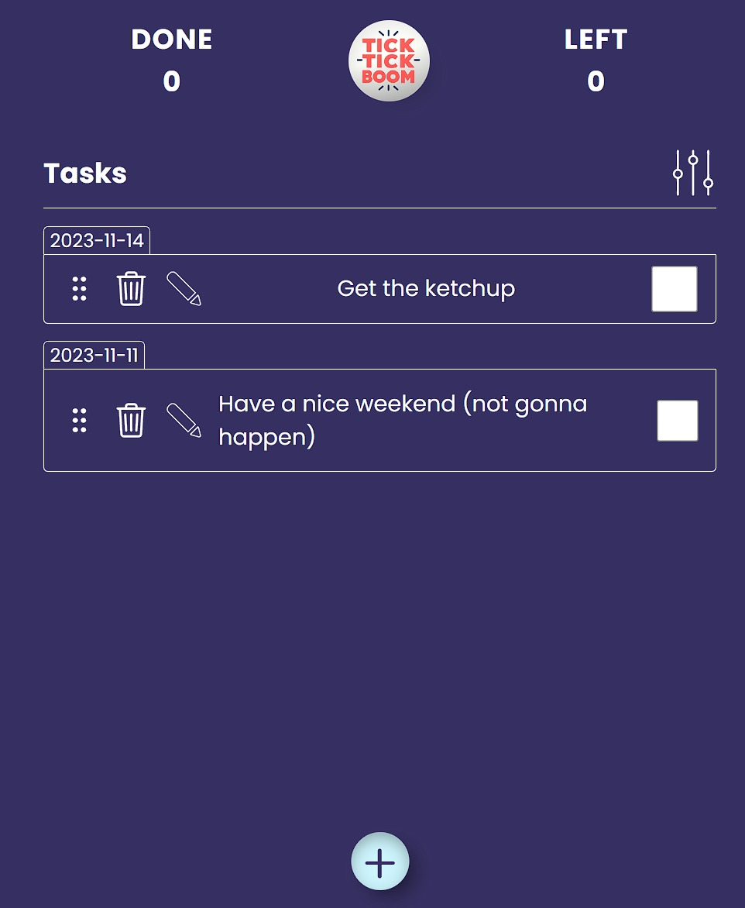
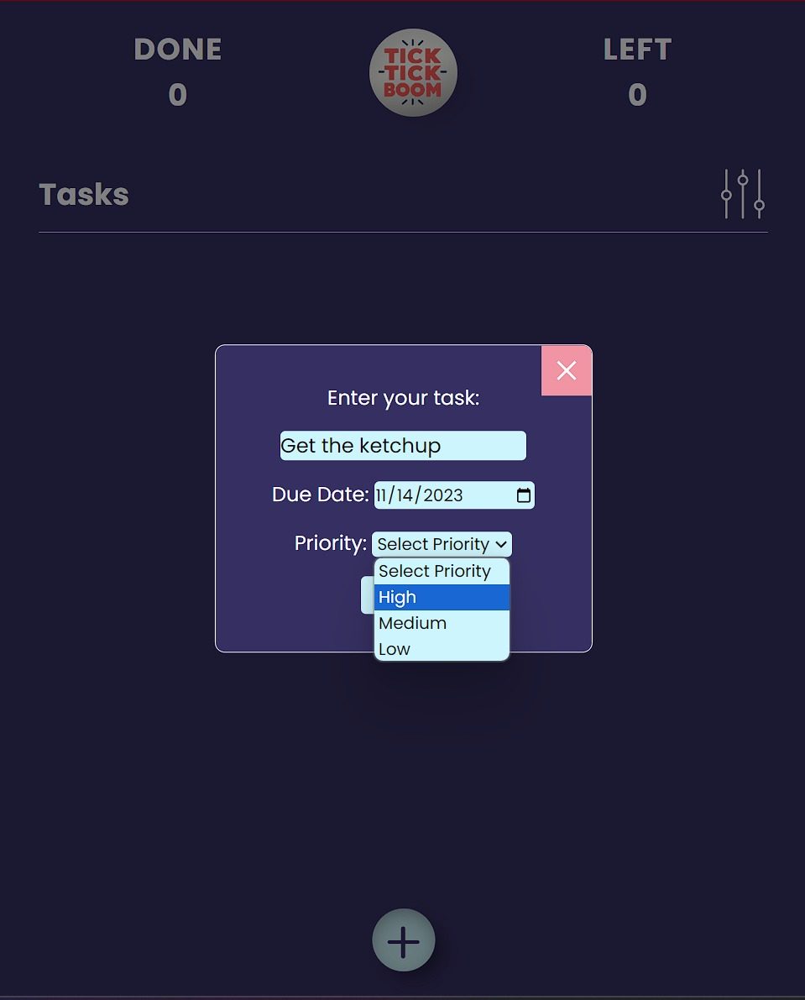

# TickTickBoom

## How did I come up with the name?

    TickTick is representing the time ticking for a certain task to be done, while the boom is for the completion of the task. 

## Description

    This is a task management app which is well known as ToDo List App. It is for organizing tasks and marking down what should be done in a certain time according to its due date and priority. 

## Features

    - creation of multiple task.
    - adding due date for a certain tasks.
    - edit and delete specific tasks.
    - Tasks filtering according to due date, priority, latest tasks, name and much more.
    - Drag to order tasks accordingly.
    - Local save for the tasks.
    - Prioritize 

## Sneak Peak to the App 👀

|  |  |
|--|--|
